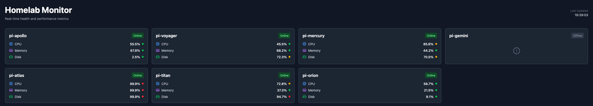
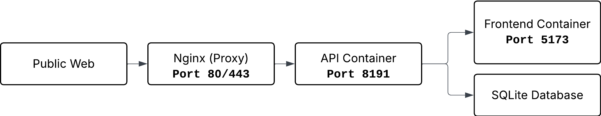

# monitor-frontend

A real-time monitoring dashboard for homelab clusters. Built with React, TypeScript, and Tailwind CSS.



## Features

- **Real-time Monitoring**: View CPU, memory, and disk usage across all devices
- **Historical Data**: Charts showing metric trends over time
- **Auto-refresh**: Metrics update every 5 seconds
- **Online/Offline Detection**: Automatically detects when devices stop reporting

## Table of Contents

- [Architecture](#architecture)
- [Prerequisites](#prerequisites)
- [Quick Start](#quick-start)
- [Development](#development)
- [Deployment](#deployment)
- [Configuration](#configuration)
- [API Integration](#api-integration)
- [Troubleshooting](#troubleshooting)

## Architecture



## Prerequisites

- Docker & Docker Compose
- Node.js 22+ (for local development)
- A running instance of the [Monitor API](https://github.com/gabrielg2020/monitor-api)


## Quick Start

### Using Docker (Recommended)

1. **Clone the repository**
    ```bash
    git clone https://github.com/gabrielg2020/monitor-frontend.git
    cd monitor-frontend
    ```

2. **Pull and run the Docker image**
    ```bash
    docker run -d \
      -p 5173:80 \
      -e API_ADDRESS=https://your-api-address.com \
      -e API_VERSION=v1 \
      --name monitor-frontend \
      ghcr.io/gabrielg2020/monitor-frontend:latest
    ```

3. **Access the dashboard**
    ```
    http://localhost:5173
    ```

### Using Docker Compose

1. **Create a `docker-compose.yml`**
    ```yaml
    services:
      frontend:
        image: ghcr.io/gabrielg2020/monitor-frontend:latest
        ports:
          - "5173:80"
        environment:
          - API_ADDRESS=https://your-api-address.com
          - API_VERSION=v1
        restart: unless-stopped
    ```
   
2. **Run Docker Compose**
    ```bash
    docker-compose up -d
    ```

## Development

### Local Setup

1. **Install dependencies**
    ```bash
    npm install
    ```

2. **Create `.env` file**
    ```bash
    cp .env.example .env
    ```

    Edit `.env`:
    ```bash
    VITE_API_ADDRESS=http://your-api-address.com
    VITE_API_PORT=your-api-port
    VITE_API_VERSION=v1
    ```

3. **Start development server**
    ```bash
    npm run dev
    ```

4. **Open browser**
    ```
    http://localhost:5173
    ```
## Deployment

### Building Docker Image
```bash
# Login to GitHub Container Registry
echo $GITHUB_TOKEN | docker login ghcr.io -u yourusername --password-stdin

# Build the image
docker build -t ghcr.io/yourusername/monitor-frontend:latest .

# Push to registry
docker push ghcr.io/yourusername/monitor-frontend:latest
```

### Production Deployment with Nginx

See [DEPLOYMENT.md](docs/DEPLOYMENT.md) for detailed nginx configuration and SSL setup.

## Configuration

### Environment Variables

| Variable      | Description     | Default            | Required |
|---------------|-----------------|--------------------|----------|
| `API_ADDRESS` | API server URL  | `http://localhost` | Yes      |
| `API_PORT`    | API server port | `8191`             | No*      |
| `API_VERSION` | API version     | `v1`               | Yes      |

_\* Leave empty if using domain without port_

### Runtime Configuration

The app uses `config.js` for runtime environment variable injection:
```javascript
window.ENV = {
    API_ADDRESS: "${API_ADDRESS}",
    API_PORT: "${API_PORT}",
    API_VERSION: "${API_VERSION}"
}
```

Variables are substituted at container startup.

## API Integration

### Expected API Endpoints
```
GET /api/v1/hosts
GET /api/v1/metrics?host_id={id}&limit={limit}
```

### Response Formats

**Hosts:**
```json
{
  "hosts": [
    {
      "id": 1,
      "hostname": "pi-01",
      "ip_address": "192.168.0.24",
      "role": "server"
    }
  ],
  "meta": {
    "count": 1
  }
}
```

**Metrics:**
```json
{
  "records": [
    {
      "id": 1,
      "host_id": 1,
      "timestamp": 1729350000,
      "cpu_usage": 45.2,
      "memory_usage_percent": 67.8,
      "disk_usage_percent": 23.4,
      "memory_total_bytes": 4294967296,
      "memory_used_bytes": 2910765875,
      "disk_total_bytes": 32212254720,
      "disk_used_bytes": 7537723520
    }
  ],
  "meta": {
    "count": 1,
    "limit": 1
  }
}
```

## Related Projects

- [Monitor API](https://github.com/gabrielg2020/monitor-api) - Backend API server
- [Monitor Agent](https://github.com/gabrielg2020/monitor-agent) - Python agent for collecting metrics
- [Monitor db](https://github.com/gabrielg2020/monitor-db) - Database schema

## License

This project is licensed under the MIT License - see the LICENSE file for details.

---

Built with 💻 by Gabriel Guimaraes